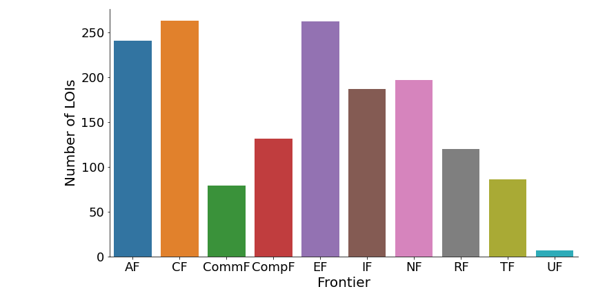

# Snowmass Letters of Interest

Over 1500 LOI's were submitted to the [Snowmass 2021](https://snowmass21.org/) process. At the University of Washington we are hard at work getting ready for the summer meeting (COVID allowing...) - and I wanted to take a look at all the incoming LOI's. The 1500 number was unexpected - I did not think that many would show up!

The LOI's here are a copy - freely downloaded. The official repository can be found from the [main website](https://snowmass21.org/). The snapshot in this data was taking just as the LOI process closed. All analysis can be found in [this github repository](https://github.com/gordonwatts/snowmass-loi-words). Feel free to submit pull requests!

## LOI's by frontier

The number of LOI's per self declared frontier:

## Detailed Information

- [All At Once](scatter/scatter.html): All 1500 LOI's represented on a single 2D plot, color coded by frontier. LOI's are clustered, approximately, by their content. Hovering gets you the name and a 100 word summary. Clicking will open a new tab loading the LOI's PDF. Enter a search-term to highlight those that contain the term (see the word list along the top of the page for valid search terms)
- [Word clouds](wordcloud) for all LOI's and for each Frontier
- [Word list](word_list) - the 4000 most important words in the PDF's. These are the words used for searching and analysis.

## Credits

Feel free to [leave an issue](https://github.com/gordonwatts/snowmass-loi-words/issues) if you have a question or a suggestion. Or [contact me](https://phys.washington.edu/people/gordon-watts) directly at the University of Washington. Many thanks to others who have [contributed](https://github.com/gordonwatts/snowmass-loi-words/graphs/contributors) and sent me suggestions. This project is far outside my wheelhouse, so it has been a lot of cut/paste and questions. Special things to the [IRIS-HEP community](https://twitter.com/iris_hep) ([web](https://iris-hep.org)) for code snippets and suggestions!
