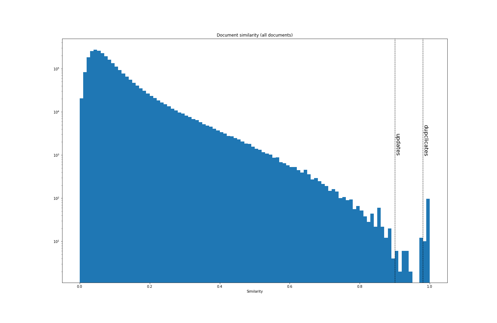

# Statistics

Some basic statistics:

- Total of {{ site.data.stats.total_documents }} LOI's were uploaded.
- Of those, {{ site.data.stats.unique_documents }} are unique. This was tested by looking for a very very high degree of matching between documents.
- Some LOI's seem to be very close to others - perhaps updates. If you exclude those, then we have {{ site.data.stats.clean_documents }} unique documents.
- This batch of LOI's were scanned from the main site on {{ site.data.stats.date_of_download }}.

## Calculating similarity

A word-vector for each document is made. From that, simple vector distance between documents is calculated. The closer the vector distance, the more common words are used. When documents are identical, of course, their vector distance is one. If you calculate the 2x2 matrix for the similarity between all documents (and ignore the diagonal), you get the following:

Everything to the right of the `duplicates` line is classified as being identical below. And everything to the right of the `updates` line is classified as being an update.

## Duplicates

These LOI's are duplicates of each other.

- [{{ loi.main_name }}]({{ loi.main_link }}):
   - [{{ dup.name }}]({{ dup.link }})


## Updates

These LOI's might be updates of each other

- [{{ loi.main_name }}]({{ loi.main_link }}):
   - [{{ dup.name }}]({{ dup.link }})

