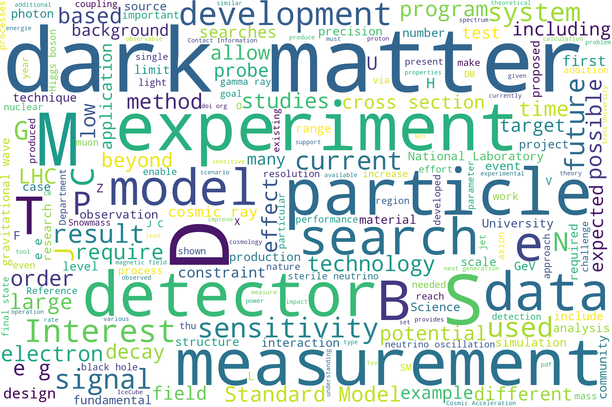
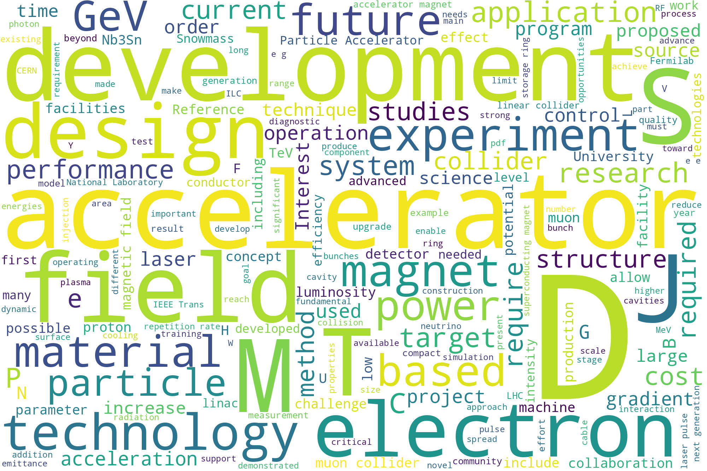
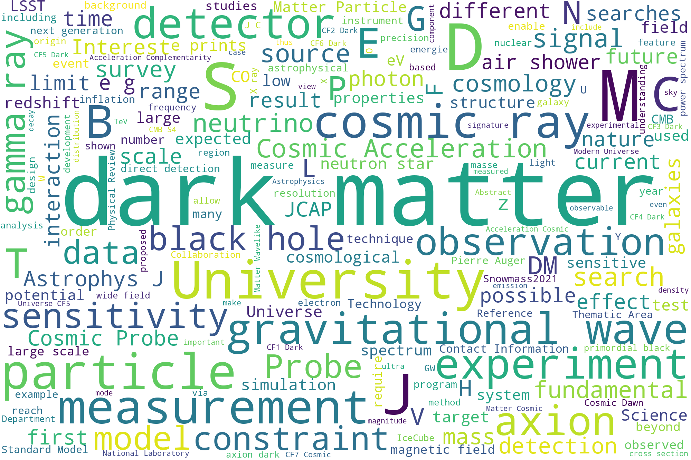
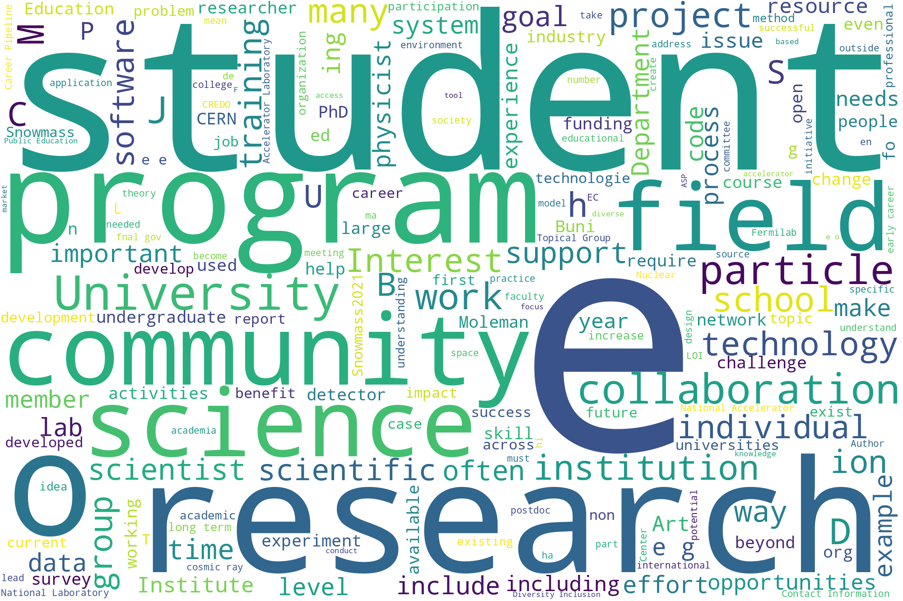
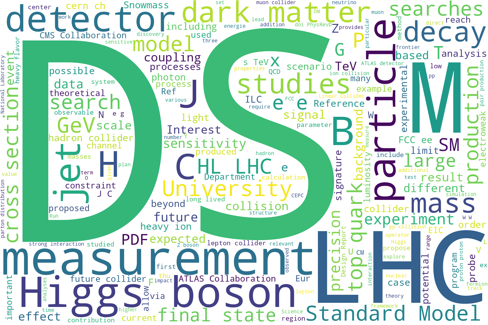
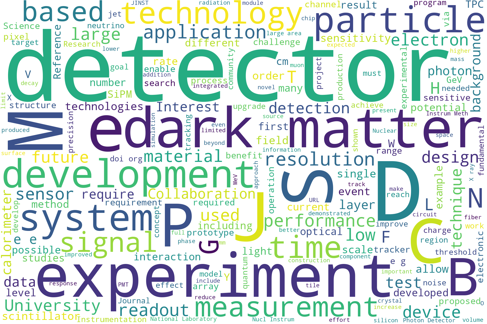
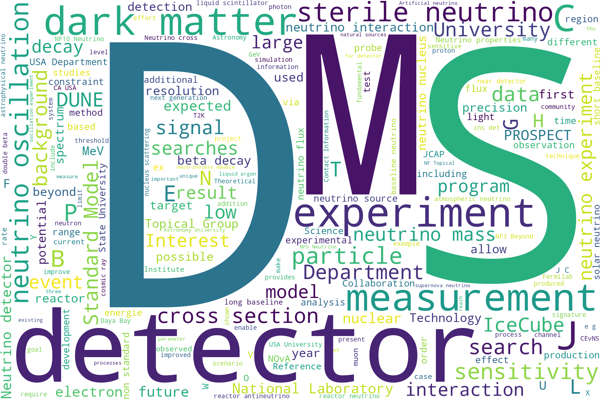
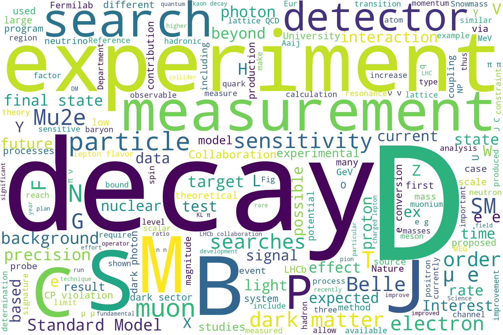
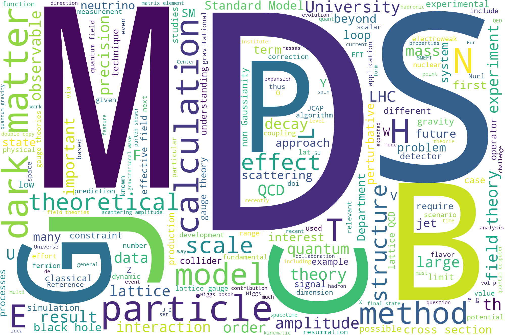
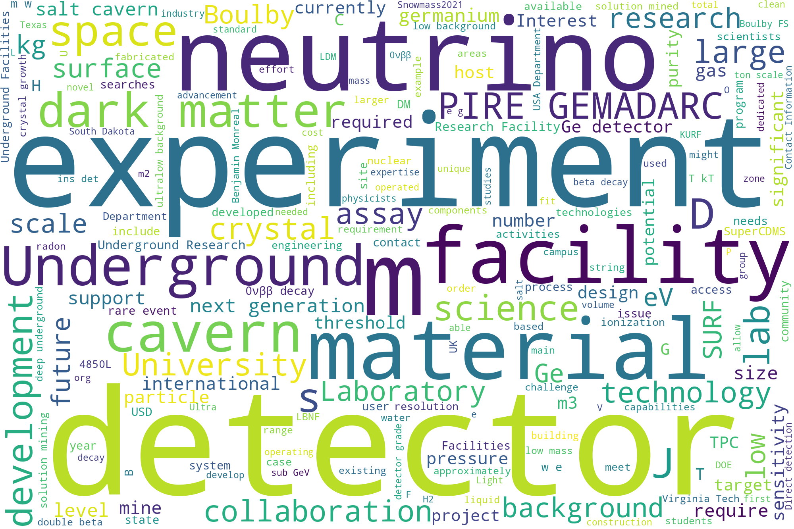

# Word Clouds

Word clouds are made by looking at the word frequency in the LOI's. The more frequent the word, the larger the font-size in the word cloud.

## All LOI's

## Accelerator Frontier

## Cosmic Frontier

## Communications Frontier

## Computational Frontier

## Energy Frontier

## Instrumentation Frontier

## Neutrino Frontier

## Rare Processes and Precision Frontier

## Theory Frontier

## Underground Facilities Frontier

## Notes

Many common words are removed, in addition some words that are HEP specific. You can see the [extras here](https://github.com/gordonwatts/snowmass-loi-words/blob/master/notebooks/config.py) (they are called 'stopwords'). If there are others that should be removed, feel free to [suggest them](https://github.com/gordonwatts/snowmass-loi-words/issues)!
